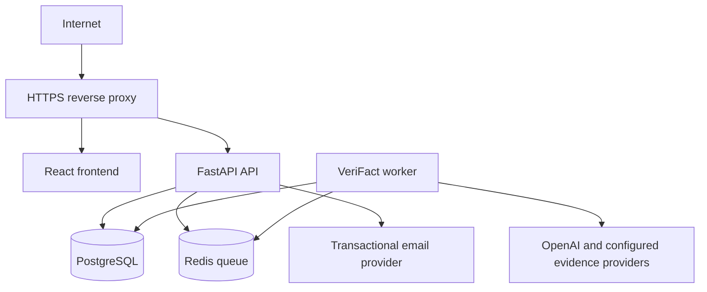

# VeriFact production deployment guide

> **Scope.** This guide promotes the existing VeriFact application to a secure production deployment. It does not replace the deterministic local fixture workflow. Local development continues to use `docker compose up` with `VERIFACT_MODE=local-fixture`.

## Production architecture



The production stack uses Caddy for certificates and HTTPS, a frontend container, a FastAPI API container, a separate Redis-backed worker, PostgreSQL, and Redis. No fixture evidence is used in `VERIFACT_MODE=production`; missing provider evidence remains an evidence limitation and never becomes a score or fabricated source.

For the Supabase deployment path, use `docker-compose.prod.yml` together with `docker-compose.supabase.yml`. The overlay removes the local PostgreSQL service and points the migration job, API, and worker at the Supabase PostgreSQL connection string while retaining Redis locally for the current RQ worker.

## Prerequisites

The operator needs a Linux host capable of running Docker Compose, a public static IP address, a domain, and DNS control. The host must allow inbound TCP ports 80 and 443. The domain’s DNS records must point to the host before Caddy can obtain a certificate.

| Item | Who provides it | Required before public launch |
|---|---|---|
| Docker-capable hosting and public IP | You / hosting provider | Yes |
| Domain and DNS access | You / registrar | Yes |
| `.env.production` values | You | Yes |
| OpenAI and evidence-provider credentials | You | Optional; production degrades to evidence limits when absent |
| SMTP/transactional email account | You | Yes for real password-reset delivery |
| Backups and off-host backup storage | You | Yes |

## External API and service requirements

The following accounts and credentials are required before the corresponding production capability can be enabled:

| Service | Required for | What you must provide | Production note |
|---|---|---|---|
| Supabase | Hosted PostgreSQL | Project reference and the server-side PostgreSQL connection string from **Connect** | Keep the password URL-encoded and require TLS. Do not put the connection string in frontend code. |
| OpenAI | Evidence-bounded structured analysis | An OpenAI API key, selected model, and an account with billing or usage capacity enabled | The key stays in FastAPI. OpenAI assists with retained evidence; it does not calculate the VeriFact score. |
| Google Fact Check Tools | Retrieval of existing ClaimReview records | A Google Cloud project, enabled Fact Check Tools API, and a restricted API key | Start with Claim Search. Confirm project quota and billing exposure in Google Cloud before launch. A no-match is not a truth verdict. |
| GDELT | Optional news discovery and timeline context | No API key is normally required; enable it only after a connectivity and rate-limit probe | Treat it as non-critical enrichment. Cache requests and back off on errors because a numeric quota or SLA is not documented. |
| NewsAPI | Optional paid news discovery | An API key and a production-eligible paid plan | The Developer plan is not for production, staging, or internal production use. Review quota, overages, attribution, and content-use terms before enabling it. |
| SMTP provider | Real password-reset email | SMTP host, port, username, password, and verified sender address | Mailpit is local-only. Test delivery and sender authentication before launch. |
| Hosting and DNS | Public HTTPS service | Docker-capable host, public IP, domain, DNS access, and inbound ports 80/443 | Caddy obtains and renews the certificate after DNS points to the host. |

Create the Supabase environment file from the committed template:

```bash
cp .env.supabase.production.example .env.supabase.production
chmod 600 .env.supabase.production
```

Fill in every required deployment value. Provider keys may remain blank during an internal infrastructure test, but live verification will then produce an evidence limitation rather than fixture evidence. `VERIFACT_OPENAI_API_KEY`, `VERIFACT_GOOGLE_FACTCHECK_KEY`, and a production NewsAPI key are not interchangeable; each comes from its own service.

## 1. Prepare the host

Clone the repository into a protected directory, then restrict access to the production environment file:

```bash
git clone https://github.com/IamFrank-codes/verifact.git
cd verifact
cp .env.production.example .env.production
chmod 600 .env.production
```

Do not commit `.env.production`. Set a unique `VERIFACT_SECRET_KEY` of at least 32 characters, a strong `POSTGRES_PASSWORD`, and a strong `REDIS_PASSWORD`. Use your intended domain in `VERIFACT_DOMAIN`, `VERIFACT_FRONTEND_ORIGIN`, `VERIFACT_PUBLIC_BASE_URL`, and `VERIFACT_ALLOWED_HOSTS`. Set `VERIFACT_TLS_EMAIL` to an address that can receive certificate notices.

## 2. Configure DNS and HTTPS

Create an `A` record for your domain, such as `verifact.example`, pointing to the production host’s public IPv4 address. Create an `AAAA` record only if the host has working public IPv6. Wait for DNS propagation, then verify that both port 80 and 443 are open at the hosting firewall.

The production Compose stack starts Caddy as the public entry point. Caddy requests and renews certificates automatically after DNS points to the host. Do not place the API, database, or Redis ports directly on the public internet.

## 3. Configure production services and credentials

Set `VERIFACT_MODE=production` and `VERIFACT_ENVIRONMENT=production`. The application validates that production uses HTTPS origins, PostgreSQL, Redis, secure cookies, and a non-default secret before it starts. With Supabase, use the external PostgreSQL URL in `.env.supabase.production` rather than the local `verifact-db` URL.

Configure `VERIFACT_OPENAI_API_KEY` and `VERIFACT_OPENAI_MODEL` only in `.env.production`. Add Google Fact Check, NewsAPI, and any future provider credentials only when you have accounts for them. Provider errors are retained as internal job results and do not become proof, evidence, or fixture data.

For password reset, configure an SMTP provider using the `VERIFACT_SMTP_*` variables. Set a verified sender address in `VERIFACT_SMTP_FROM_EMAIL`. In production the reset token is never returned in the browser response; it is sent only through SMTP when configured.

## 4. Build, migrate, and start safely

For a first deployment, build images, run the migration profile, then start the service stack. Backups are required before later upgrades, after the database already exists:

```bash
chmod +x ops/*.sh scripts/production_smoke.sh
docker compose -f docker-compose.prod.yml -f docker-compose.supabase.yml --env-file .env.supabase.production build
docker compose -f docker-compose.prod.yml -f docker-compose.supabase.yml --env-file .env.supabase.production --profile ops run --rm verifact-migrate
docker compose -f docker-compose.prod.yml -f docker-compose.supabase.yml --env-file .env.supabase.production up -d
docker compose -f docker-compose.prod.yml -f docker-compose.supabase.yml --env-file .env.supabase.production ps
```

Run migrations before changing application containers. The production API intentionally does not call `Base.metadata.create_all`; Alembic is the authoritative schema process. Do not run `docker compose down --volumes` on a production host because it destroys persistent data.

## 5. Verify readiness and smoke-test the public service

Wait for the API and worker to start, then test from the host and from an external network:

```bash
curl -fsS https://YOUR_DOMAIN/health
curl -fsS https://YOUR_DOMAIN/ready
VERIFACT_BASE_URL=https://YOUR_DOMAIN ./scripts/production_smoke.sh
```

The smoke script verifies HTTPS response availability, health, readiness, registration, authenticated session creation, and logout. Complete the remaining manual acceptance checks after configuring real providers and SMTP: password reset email delivery, worker processing, article and claim verification, eligible scores, scoreless evidence gaps, history isolation, and public/private report sharing.

## Operations

| Task | Command |
|---|---|
| View services | `docker compose -f docker-compose.prod.yml --env-file .env.production ps` |
| View API logs | `docker compose -f docker-compose.prod.yml --env-file .env.production logs -f verifact-api` |
| View worker logs | `docker compose -f docker-compose.prod.yml --env-file .env.production logs -f verifact-worker` |
| Stop services | `docker compose -f docker-compose.prod.yml --env-file .env.production down` |
| Restart services | `docker compose -f docker-compose.prod.yml --env-file .env.production restart` |
| Build an update | `docker compose -f docker-compose.prod.yml --env-file .env.production build` |
| Run migration | `docker compose -f docker-compose.prod.yml --env-file .env.production --profile ops run --rm verifact-migrate` |
| Back up PostgreSQL | `./ops/backup-postgres.sh` |
| Restore PostgreSQL | `./ops/restore-postgres.sh backups/FILE.dump` |

## Safe update and rollback procedure

Use the following deployment order: **backup → pull → build → tests → migrate → deploy → readiness check → smoke test**.

```bash
./ops/backup-postgres.sh
git pull origin main
docker compose -f docker-compose.prod.yml --env-file .env.production build
# Run repository tests in a suitable build/CI environment.
docker compose -f docker-compose.prod.yml --env-file .env.production --profile ops run --rm verifact-migrate
docker compose -f docker-compose.prod.yml --env-file .env.production up -d
curl -fsS https://YOUR_DOMAIN/ready
VERIFACT_BASE_URL=https://YOUR_DOMAIN ./scripts/production_smoke.sh
```

If the new version fails health or smoke checks, return to the last known-good Git commit, rebuild that version, and bring the containers up again. Restore the database only when the migration or data state requires it; always make a fresh backup before restoring. Keep backup dumps off the production host and test a restore procedure before relying on it.

## Monitoring and incident response

Monitor the HTTPS endpoint, `/health`, `/ready`, API container logs, worker container logs, database disk consumption, Redis memory, provider failures, and repeated authentication failures. Logs should be collected by the hosting platform or a log service and retained according to your privacy policy. Do not log passwords, API keys, reset tokens, session cookies, or full sensitive articles.

## Production acceptance checklist

Before launch, confirm that the following are true:

- The public domain serves HTTPS and redirects HTTP to HTTPS.
- `/health` and `/ready` return successfully.
- Registration, login, logout, and a real SMTP password reset work.
- An unauthenticated user cannot access private history or private reports.
- A verification is accepted by the API and processed by the Redis worker.
- Evidence retrieval failures are displayed as limitations and do not create demo evidence or a score.
- An eligible report shows transparent score components; insufficient evidence shows no overall score.
- Public sharing excludes account data and private reports remain inaccessible.
- A tested backup exists outside the host, and the recovery command is documented for the operator.

## Local development remains supported

Do not use the production Compose file for local fixtures. Continue with:

```bash
docker compose up --build
```

This keeps `VERIFACT_MODE=local-fixture`, Mailpit, deterministic evidence fixtures, and the local reset token helper available only for development.

## Academic real-API demonstration without Docker

If the objective is to demonstrate real-time provider retrieval rather than public hosting, use the lightweight academic demo track. It runs the frontend and FastAPI locally, stores data in Supabase PostgreSQL or local SQLite, and calls configured external providers directly from FastAPI. It does not require Docker, Redis, Caddy, DNS, or a public domain.

```bash
cp .env.academic-demo.example backend/.env
chmod 600 backend/.env
```

Fill in `VERIFACT_DATABASE_URL`, `VERIFACT_OPENAI_API_KEY`, and `VERIFACT_GOOGLE_FACTCHECK_KEY`. Enable `VERIFACT_GDELT_ENABLED=true` only after confirming it responds from your network. Add `VERIFACT_NEWSAPI_KEY` only when a suitable plan is available. Keep `VERIFACT_MODE=hybrid`, `VERIFACT_LOCAL_REAL_API_MODE=true`, and `VERIFACT_INLINE_PROCESSING=true`.

Start the backend and frontend using the existing local instructions. Submit a claim from `http://localhost:5173/verify`. The request will wait for the live provider calls and return the completed report without a Redis worker. This is suitable for an academic presentation, but it is not a high-concurrency production architecture because one API request remains open during processing.

For the strongest demonstration, show one claim with a matching Google Fact Check record, one claim with relevant current source retrieval, the provider provenance and canonical links, and an insufficient-evidence case. Explain that OpenAI interprets only the retained evidence packet and that the final score remains VeriFact’s deterministic calculation.
